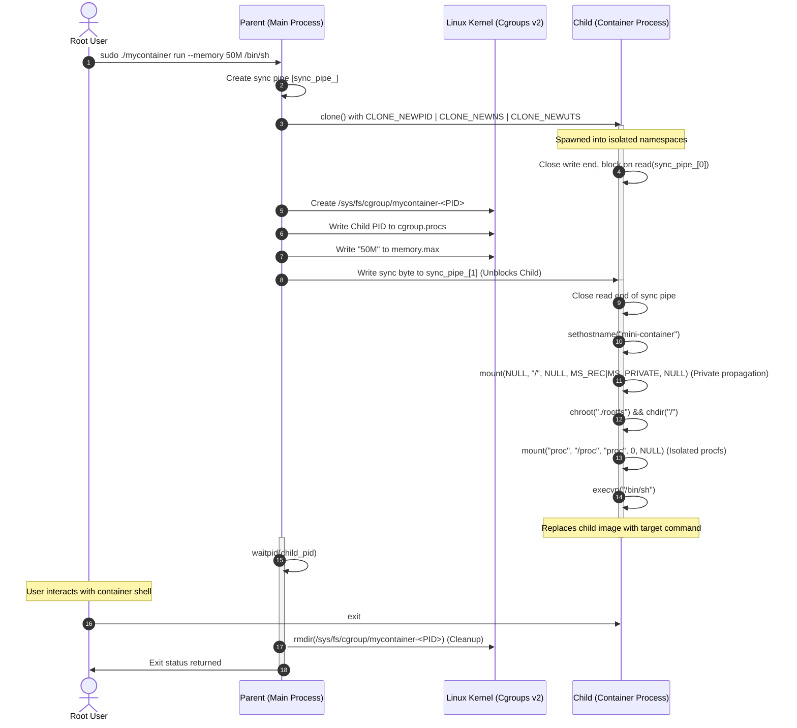
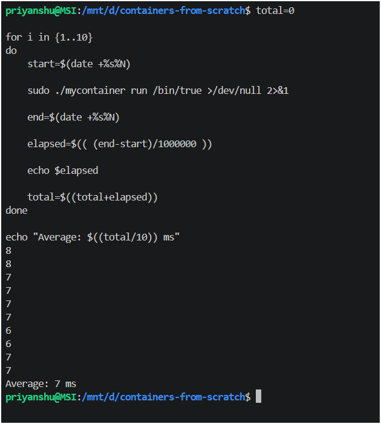
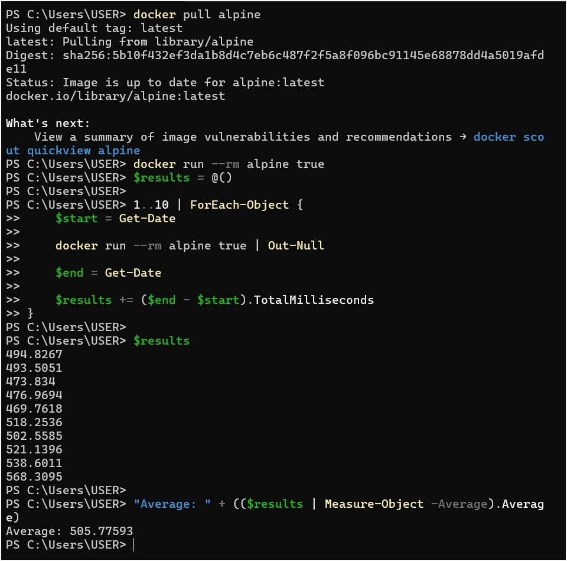

# Mini Container Runtime in C++

A custom, high-performance, educational container runtime built from scratch in C++ to demonstrate low-level Linux kernel isolation primitives. This runtime implements key kernel mechanisms that power modern container technologies like Docker and podman.

---

## Key Features

- **PID Namespace Isolation (`CLONE_NEWPID`)**: Isolates the process ID space, making the container's primary process believe it is PID 1.
- **Mount Namespace Isolation (`CLONE_NEWNS`)**: Isolates filesystem mount points, allowing private mounts that do not propagate back to the host filesystem.
- **UTS Namespace Isolation (`CLONE_NEWUTS`)**: Isolates hostname and domain name settings.
- **Filesystem Jail (`chroot`)**: Restricts the container's view to an isolated root directory (`rootfs`).
- **Dynamic procfs Remount**: Mounts a fresh, isolated `/proc` virtual filesystem so process monitoring tools (`ps`, `top`) only display container-internal processes.
- **Parent-Child Synchronization Pipe**: Safe two-way synchronization using UNIX pipes to coordinate parent setup and child execution.
- **Resource Constraints (Cgroups v2)**: Limits physical hardware utilization (memory limits, CPU quotas) using modern Linux Control Groups v2.

---

## Architectural Flow

The diagram below details the bootstrap, synchronization, and isolation sequence executed by the runtime:



---

## Implementation Details

The project is structured modularly:

- `runtime/main.cpp`: Entry point. Checks for root privileges, parses command-line flags (`--memory`, `--cpu`, `--hostname`, `--rootfs`), and initializes the container structure.
- `runtime/container.cpp`: Orchestrates container lifecycle. Allocates the stack, calls `clone()`, manages synchronization pipes, and awaits child termination to perform cgroup cleanup.
- `runtime/filesystem.cpp`: Configures mount propagation to `MS_PRIVATE` to prevent container mounts from leaking to the host. Performs `chroot` jail lock and mounts a fresh `/proc`.
- `runtime/cgroups.cpp`: Implements modern **Cgroups v2** configurations. Dynamically creates controllers, assigns processes to cgroups, and applies maximum memory boundaries and CPU scheduling periods.
- `runtime/process.cpp`: Sanitizes command vectors into C-style argument lists and triggers the kernel execution layer via `execvp`.

---

## Core Learning Outcomes

### 1. Why does `/proc` need remounting inside the container?
`/proc` is a virtual filesystem (procfs) maintained by the Linux kernel. It acts as an interface to kernel data structures and contains information about running processes. 

Even if we isolate a process in a new PID namespace using `CLONE_NEWPID`, commands like `ps`, `top`, or `htop` read process information directly from the mounted `/proc` directory. If the container continues to share the host's `/proc` mount, tools inside the container will still see all host-level processes (though attempting to kill them will fail due to namespace isolation). Remounting `/proc` cleanly inside the container's private mount namespace ensures that tools only see processes that exist in the container's PID namespace.

### 2. Why do containerized binaries require shared libraries?
Most standard Linux binaries (e.g., `/bin/bash`, `/bin/ls`) are **dynamically linked**. This means they do not contain the code for standard C library functions (like `printf` or `malloc`) inside the binary file. Instead, they rely on a runtime linker (e.g., `ld-linux.so`) to locate and load shared libraries (like `libc.so`) from the system.

When we lock a process inside a `chroot` jail, it can no longer access the host's `/lib`, `/lib64`, or `/usr/lib` directories. If the dynamic loader cannot find these shared library files inside the new rootfs, execution will fail with a highly misleading `No such file or directory` error. 
Using a complete, lightweight minirootfs like **Alpine Linux** solves this elegantly by providing a pre-configured, self-contained set of shared libraries, standard binaries, and directory structures inside the target `rootfs/` directory.

### 3. What is the fundamental difference between Namespaces and Cgroups?
- **Namespaces (Isolation - "What you can see")**: Virtualizes system resources so that a group of processes sees a dedicated instance of a system resource (e.g., PID, Mounts, Hostname, Network). It isolates *logical* resources.
- **Cgroups (Resource Limits - "How much you can use")**: Controls and limits the *physical* hardware resources allocated to a group of processes (e.g., maximum memory, CPU share, disk I/O bandwidth, network priority). It manages *physical* resource limits to prevent noisy-neighbor scenarios and denial-of-service (DoS) states on the host.

---

## Getting Started

### 1. Prerequisites
Compile and run this project inside a modern Linux environment or Windows Subsystem for Linux (WSL2) with **Cgroups v2** enabled. Ensure `g++` and `make` are installed.

```bash
# Verify Cgroups v2 is active
mount | grep cgroup2
```

### 2. Setup the Root Filesystem
Use the included automated rootfs bootstrap script to download and extract Alpine Linux minirootfs:
```bash
./setup_rootfs.sh
```

### 3. Compile the Runtime
Build the binary using the optimized Makefile:
```bash
make
```

### 4. Running the Container

Run a basic shell session with hostname isolation:
```bash
sudo ./mycontainer run /bin/sh
```

Inside the container shell, verify isolation:
```bash
# Check hostname
hostname

# Verify process list (showing only the container shell and ps as PID 1 and PID 2)
ps aux
```

### 5. Running with Resource Limits

Start a memory-constrained container (e.g., 50MB memory limit):
```bash
sudo ./mycontainer run --memory 50M --hostname sandbox /bin/sh
```

Start a CPU-constrained container restricting the process to 10% of a single CPU core (10,000µs quota per 100,000µs period):
```bash
sudo ./mycontainer run --cpu "10000 100000" /bin/sh
```

---

## Performance Benchmarks

We measured the container startup latency (the time taken to boot an isolated environment, execute `/bin/true` or equivalent, and terminate) across 10 sequential runs.

### Results & Comparison

| Iteration | `mycontainer` (WSL2 / bash) | Docker (`alpine:latest` / PowerShell) |
| :--- | :--- | :--- |
| **Run 1** | 8 ms | 494.8 ms |
| **Run 2** | 8 ms | 493.5 ms |
| **Run 3** | 7 ms | 473.8 ms |
| **Run 4** | 7 ms | 477.0 ms |
| **Run 5** | 7 ms | 469.8 ms |
| **Run 6** | 7 ms | 518.3 ms |
| **Run 7** | 6 ms | 502.6 ms |
| **Run 8** | 6 ms | 521.1 ms |
| **Run 9** | 7 ms | 538.6 ms |
| **Run 10** | 7 ms | 568.3 ms |
| **Average** | **7 ms** | **505.8 ms** |

#### Benchmark Screen Captures

**`mycontainer` Startup Latency Benchmark (Average: 7ms)**


**Docker Startup Latency Benchmark (Average: 505.8ms)**


### Analysis

`mycontainer` starts **~72x faster** than Docker. 
* **Docker's Overhead**: Docker relies on a background service client-server daemon architecture (`dockerd`/`containerd`), REST APIs, gRPC channels, and complex virtual network bridge creation.
* **Our Implementation**: Since `mycontainer` is written in C++ and interacts directly with host Linux kernel primitives (namespaces, chroot, and Cgroups v2) without external background daemons or API routing layers, it spins up near-instantly with minimal memory and processing footprint.
